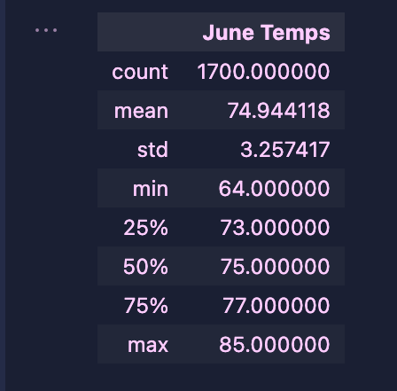
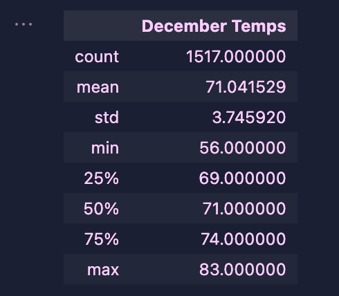

# Surfs_Up
# Overview and Purpose

In this challenge we analyzed weather data stored in a sqlite file using numpy and pandas, in addition to a new tool called sqlalchemy. 

The purpose of this analysis is to help our client decide if a surf and ice cream shop would be a sustainable business throughout the whole year. We are instructed to perform an analysis on the months of June and December to compare weather conditions during the summer and winter months. In our analysis we calculate the minimum, average and maximum temperature, as well as quartiles and standard deviation of temperatures for both months. 

# Results 

In the conclusion of our analysis we generate two tables; the summary statistics of June Temps and the summary statistics of December Temps. Both tables are displayed below:

From the summary statistics of each months I was able to identify three key differences:

- The number of data points recorded for each month is different - there are nearly 200 more data points in the June analysis than there are in the December analysis.
- From our summary statistics we can see that the average(mean) temperature is higher in June than it is in December by nearly 4 degrees. 
- The most significant difference between these two datasets is the minimum temperature. In June the minimum temperature recorded is 64 degrees. This is 8 degrees higher than the minimum temperature recorded in December, which is 56 degrees. 

# Summary
There are two additional analyses that could add more insight to the clients question:
- Our current analysis only focuses on weather data gathered during summer and winter months. To give the client a more accurate analysis of the whole year we could include spring and fall months as well. To do this I would repeat the analysis for March and September. 
- Our current analysis ignores the precipitation data in our sqlite dataset. I would perform an analysis on the precipitation data and investigate whether or not precipitation levels has an affect on the success of the surf and ice cream shop.  
